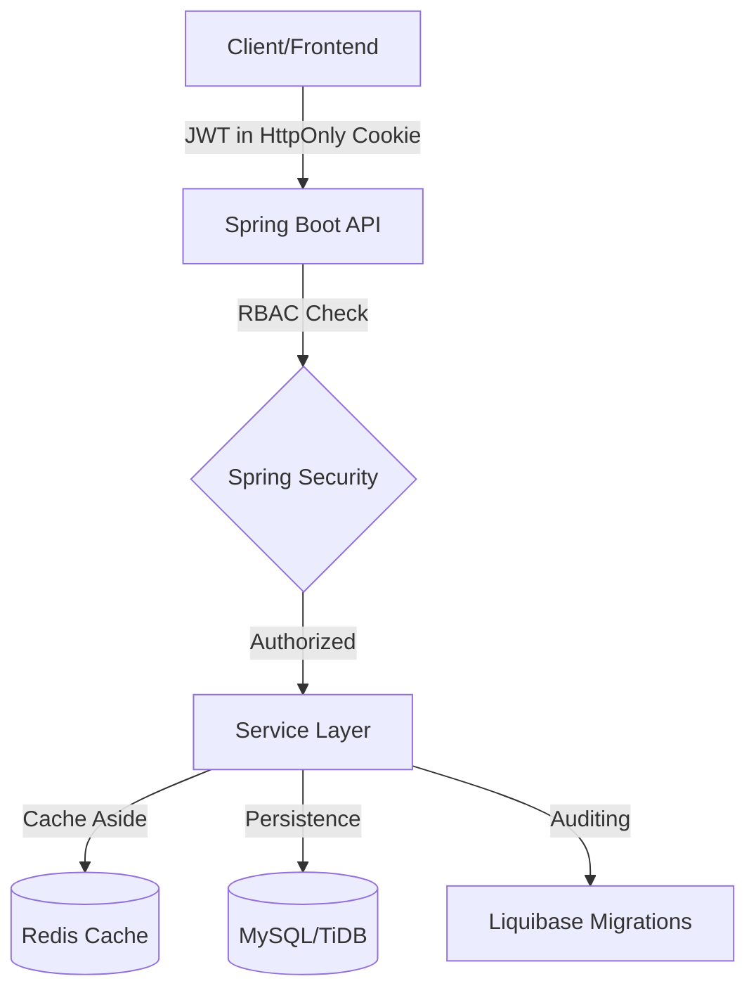

# 🏟️ Stadium Booking System (V2)
### Production-ready stadium reservation backend focused on consistency, reliability, and scalability (Java 21, Spring Boot 3.4.5)

[](https://openjdk.org/)
[](https://spring.io/projects/spring-boot)
[](https://www.mysql.com/)
[](https://redis.io/)
[](https://www.liquibase.com/)
[](https://testcontainers.com/)
[](https://github.com/features/actions)

**Stadium Booking System** is a reservation engine designed to keep booking data correct under concurrent requests, with strict schema management and a CI pipeline that runs unit + integration tests before shipping a Docker image.

> Live Demo (Hugging Face): https://hamzasaleh-stadium-booking.hf.space/  
> Swagger UI: https://hamzasaleh-stadium-booking.hf.space/swagger-ui/index.html  
> Health: https://hamzasaleh-stadium-booking.hf.space/actuator/health

---

## 🏗️ Architecture Overview

**High-level design :**
- Layered architecture: **Controller → Service → Repository**
- **Stateless** REST API (Spring Security + JWT)
- **MySQL** as the system of record (JPA/Hibernate)
- **Redis** for caching (Spring Cache + Spring Data Redis)
- **Liquibase** for schema versioning (Hibernate set to `validate`)
- **Actuator** health endpoint for deployment readiness checks

### Architecture Diagram




---

## 🧱 Core Engineering Pillars

### 1) Concurrency Strategy (Optimistic Locking)
**What exists in code**
- Optimistic locking via `@Version` is present in:
  - `User`
  - `Stadium`
  - `Booking`
- Global exception handling maps optimistic-lock conflicts to **HTTP 409 Conflict**.

**Why this matters**
- Booking is contention-heavy (same stadium/time slots). Optimistic locking avoids heavyweight DB locks while still preventing lost updates.

**Concurrency behavior note**
- Under concurrent updates, the system fails safely (409) rather than corrupting state.
---

### 2) Security Architecture (Stateless JWT + RBAC)
**What exists in code**
- `STATELESS` sessions + JWT authorization filter.
- RBAC via Spring Security request matchers + authorities:
  - Stadium write endpoints require `ROLE_ADMIN` or `ROLE_MANAGER`
  - Booking endpoints allow `ROLE_ADMIN` and `ROLE_PLAYER`
  - Public access is allowed for Swagger, health, login/refresh, user registration, and stadium reads
- Password hashing: `BCryptPasswordEncoder`
- Refresh token delivered as an **HttpOnly cookie** (`refresh_token`) with `SameSite=Lax`.

**Why this matters**
- Stateless auth scales horizontally (no server-side sessions).
- HttpOnly refresh cookie reduces exposure to XSS compared to JS-accessible storage.
- Explicit authority-based access rules make permissions auditable.

**CORS note (observed)**
- Current CORS allows `*` origins.  
  ⚠️ **In production environments this should be restricted to trusted origins only**.

---

### 3) Reliability & Data Integrity (Liquibase + strict schema validation)
**What exists in code**
- Liquibase changelog configured: `classpath:db/changelog/db.changelog-master.yaml`
- Hibernate DDL: `spring.jpa.hibernate.ddl-auto=validate` (local + prod)
- Centralized error responses and typed handling (validation, DB errors, optimistic locking, etc.)

**Why this matters**
- `validate` prevents accidental schema drift.
- Liquibase provides deterministic schema evolution (reviewable migrations) which is essential for repeatable deployments.

---

## 🧰 Infrastructure & DevOps

### Docker (Multi-stage)
Multi-stage Docker build produces a runnable jar and runs it on a small JRE base image.
- Entrypoint runs with `prod` profile and port `7860`.
- Build uses `spring-boot:repackage` to ensure the jar is executable.

### Docker Compose (Local prod-like stack)
`docker-compose.yml` provisions:
- **MySQL 8.0** with a health check
- **Redis** with password + health check
- **App** enabled under the `prod` compose profile, depends on healthy DB/cache

**Why this matters**
- Health checks + `depends_on: condition: service_healthy` reduce flaky local boots and make CI/local startup deterministic.

### CI/CD (GitHub Actions)
Workflow builds confidence before deployment:
- Unit tests (exclude `*IT`)
- Integration tests (`*IT`)
- Build & push Docker images to Docker Hub (`latest` + versioned tag)
- Restart Hugging Face Space via API call

---

## 🚀 Quick Start (Local prod-like stack)

### Prerequisites
- Docker + Docker Compose

### 1) Create `.env`
Your compose + Spring profiles expect:
| Variable | Used For |
|---|---|
| `DB_NAME` | MySQL database name |
| `MYSQL_ROOT_PASSWORD` | MySQL root password |
| `REDIS_PASSWORD` | Redis auth |
| `JWT_SECRET` | JWT signing secret |
| `JWT_ISSUER` | JWT issuer |

### 2) Run
```bash
docker compose --profile prod up -d --build
```

### 3) Verify
- API: http://localhost:7860
- Swagger: http://localhost:7860/swagger-ui/index.html
- Health: http://localhost:7860/actuator/health

Stop:
```bash
docker compose --profile prod down
```

Reset (removes DB volume):
```bash
docker compose --profile prod down -v
```

---

## 🧪 Testing Strategy

### Unit Tests
- JUnit 5 + Spring Boot test starter
- JWT unit tests exist (e.g., `JwtProviderTest`)

Run:
```bash
./mvnw test -Dtest="!*IT"
```

### Integration Tests (Testcontainers)
- Integration tests run with **real MySQL + Redis containers** (Testcontainers)
- Naming convention: `*IT`

Run:
```bash
./mvnw test -Dtest="*IT"
```

**Why this matters**
- Integration tests against real infra catch issues mocks won’t (schema mismatch, connection config, serialization, Redis behavior).

---

## 📚 API Documentation (Swagger)
- Local: http://localhost:7860/swagger-ui/index.html
- Live: https://hamzasaleh-stadium-booking.hf.space/swagger-ui/index.html

---

## 🗺️ Roadmap (Future Goals — not implemented yet)
- Restrict CORS to trusted origins + review cookie `secure=true` when deployed behind HTTPS.
- Add explicit CSRF strategy if browser clients rely on cookie-based auth across origins.
- Add rate limiting for auth endpoints.
- Add resilience patterns (e.g., circuit breaker / retries) for external dependencies.
- Add load testing (k6) + publish a concurrency simulation report/video demonstrating conflict handling (409) with zero double-booking.
- Add stronger observability (structured logs with correlation IDs, metrics dashboards, tracing).

---

## 👤 Author
**Hamza Saleh**  
GitHub: https://github.com/hamzasaleh12  
LinkedIn: https://www.linkedin.com/in/hamza-saleh-908662392/